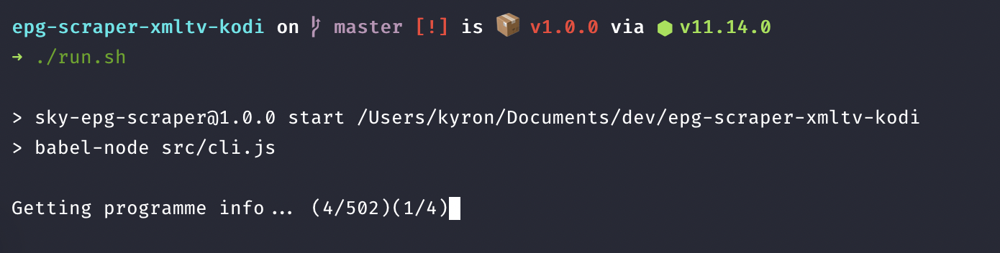

# Sky EPG Tool

For Kodi and other XMLTV supporting systems.

_underwent a full refactor and now it's an [npm package!](https://www.npmjs.com/package/sky-epg-scraper)_




Example file: https://gist.github.com/gitbugr/e26ed2d8bcd21a6684a2408997b60988

## Installation (as application)

```bash
git clone https://github.com/gitbugr/sky-epg-xmltv-kodi.git
cd sky-epg-xmltv-kodi
```

## Running the Application

There are two ways you can run the application;

### Setting up Environment

First you'll want to set up your environment by editing the .env file in the root
of the project.

```env
GIST_ID={YOUR_GIST_ID}
GIST_TOKEN={YOUR_GIST_TOKEN}
GIST_FILENAME={ANY_FILENAME}
REPEAT_SECONDS=600
```

### Option 1: Node

To run this on your host machine using node, you'll first need to install the
required packages.

```bash
npm install
```

Then run the startup script.

```bash
./run.sh
```

### Option 2: Docker

You can run the application in a docker container (requires docker installation)
as follows:

**then run**

```bash
docker-compose up -d --build
```

## Usage as NPM Module

### Installation

```bash
yarn add sky-epg-scraper
# or
npm install sky-epg-scraper
```
